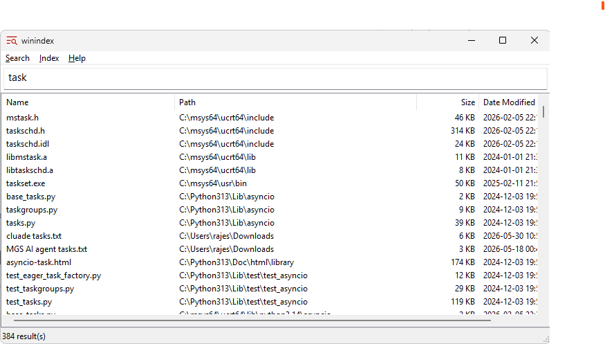

# winindex



Blazing fast file search for Windows. winindex builds a full index of your local drives and returns results as you type, with no perceptible delay even across millions of files.


---

## Features

- **Instant search** — results appear as you type, debounced at 150 ms
- **MFT scanning** — on NTFS drives with administrator privileges, winindex reads the Master File Table directly, indexing a full drive in seconds rather than minutes
- **Fallback scanner** — on FAT32, or without elevation on NTFS, a fast `FindFirstFile` BFS scanner is used automatically
- **Regex support** — powered by [RE2](https://github.com/google/re2); toggle with Alt+1
- **SIMD-accelerated substring search** — dispatch to AVX2 or SSE4.2 when compiled with `/arch:AVX2`, scalar fallback otherwise
- **Word-level matching** — queries with spaces, underscores, or hyphens match filenames by token set, so `just rosy guitar` finds `LedZep_Just-Rosy_June-Bug_guitar.flac` even though the words are non-adjacent and separated by different delimiters
- **Search modes** — case-sensitive, whole-word, match full path, ignore diacritics; all togglable from the Search menu
- **Change detection** — USN journal replay and `ReadDirectoryChangesW` watcher are wired in and ready; live background monitoring is in active development
- **Portable mode** — place a `winindex.ini` next to the executable and all data stays in that directory
- **Persistent index** — the index is serialised to disk (CRC-32 validated) and loaded on startup; only rebuilt when stale or missing
- **Context menu** — open file, open containing folder, copy full path, copy filename, cut (shell move), delete (Recycle Bin)
- **Smart exclusions** — Windows system folders, `Program Files`, `ProgramData`, AppData, and user-configurable paths are excluded by default

---

## How it works

```
  MftScanner / FindFileScanner
           |
           | scan
           v
        Indexer  ----------->  IndexStore (memory + .idx)
                    index               |
  UsnJournalMonitor  -------> (apply    | entries
  ChangeWatcher       change)  changes) |
                                        v
                               SearchEngine (RE2 / scalar)
                                        |
                                        | results
                                        v
                                MainWindow (Win32 UI)
```

### Index build

1. On first launch, a setup dialog asks which drives to index and which paths to exclude.
2. The **Indexer** checks whether a valid on-disk index exists (configurable max-age, default 48 h). If not, it rebuilds.
3. For each selected drive the appropriate scanner is chosen:
   - **MftScanner** — opens the volume with `GENERIC_READ` and issues `FSCTL_ENUM_USN_DATA` to walk the MFT without touching individual directories.
   - **FindFileScanner** — iterative BFS using `FindFirstFile`/`FindNextFile`, skipping reparse points to avoid symlink loops.
4. Entries (name, full path, size, last-modified, attributes) are accumulated in **IndexStore** and flushed to `winindex.idx` on completion.

### Search

Each keystroke (after a 150 ms debounce) spawns a background `std::thread`:

- **Substring mode** — the needle and each filename are lowercased once; `SimdFindSubstring` dispatches to the fastest available SIMD path at runtime.
- **Token-set mode** — when the query contains a separator character (space, `_`, `-`, `.`), both the query and each filename are split into tokens and the file matches if every query token appears somewhere in the filename token set. This lets `just rosy guitar` match `LedZep_Just-Rosy_June-Bug_guitar.flac` without regex. Single-word queries skip this path entirely, keeping the SIMD fast path.
- **Regex mode** — filenames (or full paths in match-path mode) are converted to UTF-8 and matched with a compiled `RE2` pattern.
- Results are capped at 10 000 and rendered in a virtual `LVS_OWNERDATA` ListView for zero-copy display.

### Change monitoring

**UsnJournalMonitor** can replay USN journal records (additions, deletions, renames) directly into the in-memory store, and **ChangeWatcher** provides `ReadDirectoryChangesW`-based monitoring for non-NTFS volumes. Full background monitoring after the initial build is in active development.

---

## Building

### Requirements

| Tool | Minimum version |
|------|----------------|
| Windows | 10 or above |
| Visual Studio Build Tools | 2026 (local builds); CI auto-detects 2022+ |
| CMake | 3.28 |
| Git | any recent |

Third-party dependencies (**re2**, **abseil**, **GoogleTest**) are fetched automatically by CMake's `FetchContent` — no manual installation needed.

### Quick build

```bat
# Debug
build.bat debug

# Release
build.bat release
```

Or with CMake presets directly:

```bat
cmake --preset windows-msvc-release
cmake --build --preset release
```

Binaries land in `build/release/src/ui/Release/winindex.exe`.

### Running tests

```bat
build.bat test
```

---

## Settings & configuration

Settings are stored in `%APPDATA%\winindex\winindex.ini` (or next to the `.exe` in portable mode).

| Setting | Default | Description |
|---------|---------|-------------|
| `SelectedDrives` | *(chosen on first run)* | Semicolon-separated paths to index, e.g. `C:\;D:\;E:\projects\` (drive roots or specific folders) |
| `ExcludedPaths` | See below | Pipe-separated paths excluded from indexing |
| `ReindexIntervalHours` | `48` | Hours before the index is considered stale; `0` = manual only |
| `UseRegex` | `0` | Enable RE2 regex search |
| `CaseSensitive` | `0` | Case-sensitive matching |
| `WholeWord` | `0` | Whole-word matching |
| `MatchPath` | `0` | Match against the full path instead of filename only |
| `IgnoreDiacritics` | `0` | Fold diacritics before matching |

### Default excluded paths

- `%SystemDrive%\Windows`
- `%SystemDrive%\Program Files`
- `%SystemDrive%\Program Files (x86)`
- `%SystemDrive%\ProgramData`
- `%SystemDrive%\$Recycle.Bin`
- `%SystemDrive%\System Volume Information`
- `%SystemDrive%\drivers`
- `%APPDATA%` (Roaming)
- `%LOCALAPPDATA%`

These are applied as the initial default on a new install. Once a user has saved their own exclusion list, that list is used as-is and the defaults are not re-injected.

---

## Keyboard shortcuts

| Key | Action |
|-----|--------|
| Alt+1 | Toggle regular expression mode |
| Alt+2 | Toggle case-sensitive |
| Alt+3 | Toggle whole-word |
| Alt+4 | Toggle match path |
| Alt+5 | Toggle ignore diacritics |
| Down / Up | Move focus from search bar to result list |
| Enter | Open selected file |
| Ctrl+Enter | Open containing folder |
| Ctrl+C | Copy full path(s) |
| Ctrl+X | Cut (shell move to clipboard) |
| Delete | Move to Recycle Bin |

You can also **drag files** directly from the result list to Explorer, the Desktop, or any drop target that accepts `CF_HDROP` (copy or move).

---

## Project structure

```
winindex/
  src/
    core/
      indexer/      MftScanner, FindFileScanner, Indexer, ChangeWatcher, USN journal
      search/       SearchEngine, SIMD search, RE2 integration, TokenMatcher (word-level matching)
      settings/     Settings (INI), PathUtils
      storage/      IndexStore, IndexSerializer (binary format + CRC-32)
    ui/
      assets/       Source icon and screenshot
      MainWindow.*  Main Win32 window, search bar, result ListView
      FirstRunDialog.*  Drive/exclusion setup on first launch
      SettingsDialog.*  Settings accessible from Index menu
      winindex.rc   Resources (menus, dialogs, icon)
  tests/            GoogleTest/GoogleMock unit tests
  .github/
    workflows/      CI: build+test on every push; release packages on tags
  CMakeLists.txt
  CMakePresets.json
  build.bat         Convenience wrapper: build.bat [debug|release]
```

---

## Releases

Tagged releases (`v*`) trigger the CI release job which produces:

- **ZIP** — portable build, extract and run
- **NSIS installer** — installs to `Program Files`, creates a Start Menu shortcut
- **SHA256SUMS.txt** — checksums for both assets above

### Verifying a download

Each release includes `SHA256SUMS.txt`. After downloading an asset, verify it matches:

```powershell
Get-FileHash winindex-*.zip -Algorithm SHA256
# compare against the matching line in SHA256SUMS.txt
```

Release tags are not currently signed; checksums are the verification path today.

---

## Development setup

After cloning:

```powershell
winget install Python.Python.3.12 LLVM.LLVM Cppcheck.Cppcheck
pip install pre-commit
pre-commit install
pre-commit install --hook-type pre-push
```

`pre-commit install` wires commit-time checks (clang-format, cppcheck).
`pre-commit install --hook-type pre-push` wires the pre-push gate that builds and runs the full test suite before a push.

To run all checks on the full codebase (one-time cleanup):

```powershell
pre-commit run --all-files
```

---

## License

MIT
